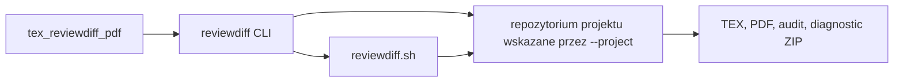
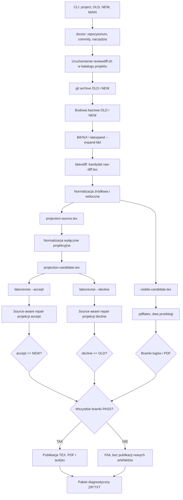
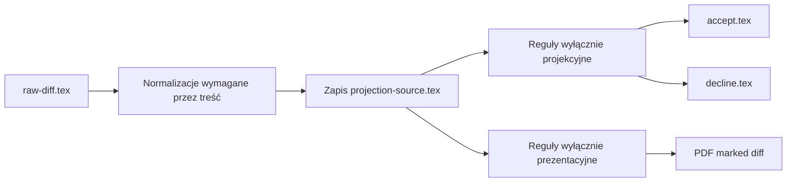
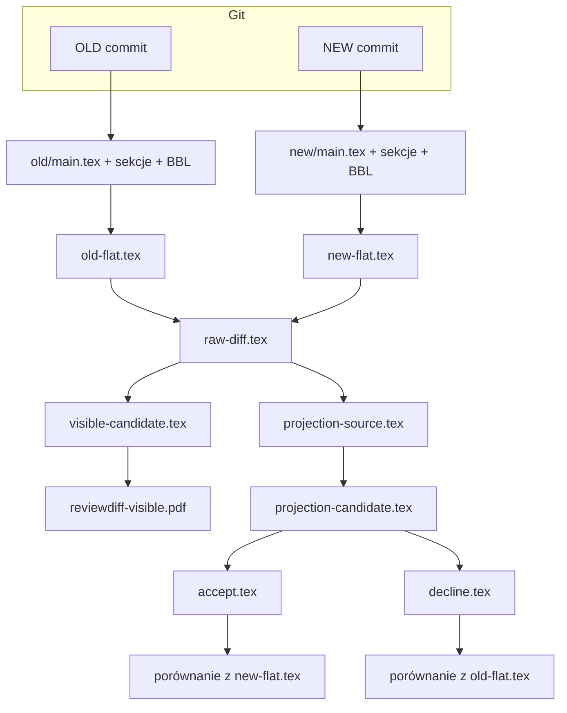
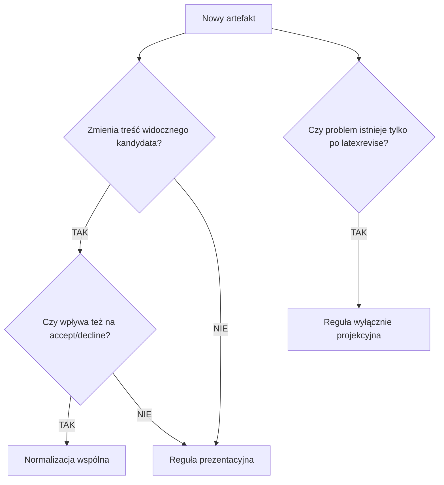

# `tex_reviewdiff_pdf`

Projekt udostępnia CLI `reviewdiff` oraz kanoniczny silnik `reviewdiff.sh`. CLI oddziela repozytorium narzędzia od repozytorium analizowanego projektu i jest zalecanym interfejsem użytkownika.

`reviewdiff.sh` to deterministyczny generator oznaczonego PDF-a rewizji artykułu LaTeX na podstawie dwóch commitów Git.

Skrypt buduje źródła `OLD` i `NEW`, rozwija bibliografię, generuje kandydat przez `latexdiff`, naprawia znane klasy artefaktów, tworzy projekcje `accept` i `decline`, kompiluje PDF oraz publikuje wynik wyłącznie po przejściu wszystkich bramek audytowych.

> **Źródło prawdy:** różnica Git pomiędzy `OLD` i `NEW`. `latexdiff` jest wyłącznie generatorem kandydata oznaczeń i nie jest traktowany jako dowód kompletności.


## Szybki start

Repozytorium `tex_reviewdiff_pdf` zawiera narzędzie. Projekt LaTeX może znajdować się w osobnym repozytorium Git i jest wskazywany przez `--project`.

### 1. Szybkie testy narzędzia

```zsh
cd /Users/drone/Documents/Publications/tex_reviewdiff_pdf && \
./reviewdiff test quick
```

### 2. Weryfikacja projektu przed uruchomieniem

```zsh
cd /Users/drone/Documents/Publications/tex_reviewdiff_pdf && \
./reviewdiff doctor \
  --project /Users/drone/Documents/Publications/pawr-ieee-iot \
  --old 19bdc838918c9e89a4d4451784dd078e0a0671e1 \
  --new 93dbca00a6d4e6a494f1eb923223c0bd90ddf765 \
  --main main.tex
```

### 3. Generowanie marked diff

```zsh
cd /Users/drone/Documents/Publications/tex_reviewdiff_pdf && \
./reviewdiff run \
  --project /Users/drone/Documents/Publications/pawr-ieee-iot \
  --old 19bdc838918c9e89a4d4451784dd078e0a0671e1 \
  --new 93dbca00a6d4e6a494f1eb923223c0bd90ddf765 \
  --main main.tex
```

### 4. Pełny test integracyjny

```zsh
cd /Users/drone/Documents/Publications/tex_reviewdiff_pdf && \
./reviewdiff test full \
  --project /Users/drone/Documents/Publications/pawr-ieee-iot \
  --old 19bdc838918c9e89a4d4451784dd078e0a0671e1 \
  --new 93dbca00a6d4e6a494f1eb923223c0bd90ddf765 \
  --main main.tex \
  --keep-tmp
```

Pełny test wykonuje pipeline, sprawdza dokładne projekcje `accept == NEW` i `decline == OLD`, stosuje binarny Git diff do drzewa OLD oraz porównuje wszystkie zmienione ścieżki z NEW.

Szczegóły:

- [Referencja CLI](CLI.md)
- [Testowanie i weryfikacja](TESTING.md)
- [Historia zamkniętych regresji](docs/test-history.md)

> Bezpośrednie `reviewdiff.sh` jest interfejsem niskopoziomowym. Należy je uruchamiać z katalogu repozytorium projektu zawierającego wskazane commity. W normalnej pracy używaj CLI `reviewdiff` z argumentem `--project`.

## Status kanoniczny

Aktualnie zablokowana wersja po TEST46:

```text
reviewdiff.sh SHA256:
a56c8a6112138f0069d43aee894cb3a2b1bddf8cf87ac38ec5ebf44f50674bee

TEST46=PASS/LOCK
```

Kanoniczne porównanie projektu:

```text
OLD=19bdc838918c9e89a4d4451784dd078e0a0671e1
NEW=93dbca00a6d4e6a494f1eb923223c0bd90ddf765
MAIN=main.tex
```

Dla tego porównania potwierdzono:

```text
FULL_PIPELINE=PASS
PDF_BUILD=PASS
ACCEPT_EXACT_NEW=PASS
DECLINE_EXACT_OLD=PASS
GIT_BINARY_DIFF_OLD_TO_NEW=PASS
GIT_CHANGED_PATHS_MATCHED=14/14
VISIBLE_NORMALIZATION_IDEMPOTENCE=PASS
CLI_QUICK_TEST=PASS
CLI_DOCTOR=PASS
CLI_FULL_TEST=PASS
CLI_VERIFY=PASS
```

Nie należy zmieniać reguł oznaczonych `PASS/LOCK` bez nowego, reprodukowalnego dowodu regresji.

## Spis treści

- [Szybki start](#szybki-start)
- [Interfejs CLI](#interfejs-cli)
- [Cel i gwarancje](#cel-i-gwarancje)
- [Architektura](#architektura)
- [Przepływ danych](#przepływ-danych)
- [Wymagania](#wymagania)
- [Uruchamianie](#uruchamianie)
- [Artefakty wyjściowe](#artefakty-wyjściowe)
- [Etapy pipeline](#etapy-pipeline)
- [Warstwa normalizacji widocznego dokumentu](#warstwa-normalizacji-widocznego-dokumentu)
- [Projekcje accept i decline](#projekcje-accept-i-decline)
- [Bramki bezpieczeństwa i audytu](#bramki-bezpieczeństwa-i-audytu)
- [Obsługa błędów](#obsługa-błędów)
- [Pakiet diagnostyczny](#pakiet-diagnostyczny)
- [Serwisowanie i rozwój](#serwisowanie-i-rozwój)
- [Procedura dodawania nowej reguły](#procedura-dodawania-nowej-reguły)
- [Regresja i idempotencja](#regresja-i-idempotencja)
- [Znane ograniczenia](#znane-ograniczenia)
- [Lista kontrolna wydania](#lista-kontrolna-wydania)

## Interfejs CLI

CLI jest implementowane w Pythonie przy użyciu biblioteki standardowej `argparse`. Nie wymaga instalowania pakietu `fire` ani innych zależności Python.

```text
reviewdiff doctor
reviewdiff run
reviewdiff test quick
reviewdiff test full
reviewdiff verify
reviewdiff extract-git-diff
reviewdiff --version
```

### Rozdzielenie repozytoriów



`reviewdiff.sh` pozostaje jedynym silnikiem produkcyjnym. CLI nie powiela jego normalizacji. Waliduje wejścia i uruchamia skrypt z katalogiem roboczym ustawionym na repozytorium projektu.

### `doctor`

Sprawdza przed kosztownym uruchomieniem:

- obecność i SHA256 zablokowanego `reviewdiff.sh`;
- składnię Bash;
- czy `--project` wskazuje katalog główny repozytorium Git;
- dostępność commitów OLD i NEW;
- obecność `main.tex` w obu commitach;
- dostępność wymaganych narzędzi systemowych.

### `run`

Uruchamia produkcyjny pipeline w repozytorium projektu. Opcja `--keep-tmp` zachowuje katalog `/tmp/reviewdiff.*`.

### `test quick`

Weryfikuje zablokowany hash, składnię, markery zamkniętych reguł oraz testy dodatnie, negatywne, wielokrotne i idempotencję TEST46. Nie wymaga repozytorium artykułu.

### `test full`

Wykonuje `doctor`, testy szybkie, pełny pipeline oraz niezależną walidację artefaktów i bezpośredniego binarnego Git diff.

### `verify`

Sprawdza już istniejący wynik bez ponownej kompilacji.

### `extract-git-diff`

Wyciąga `git/old-new.binary.diff` z `reviewdiff-auto-diagnostic.zip.txt` do wskazanego pliku.

## Cel i gwarancje

Skrypt rozwiązuje problem generowania czytelnego marked diff dla złożonego artykułu IEEE zawierającego między innymi:

- wieloplikowe źródła LaTeX,
- bibliografię BibTeX,
- tabele `tabular` i `tabularx`,
- środowiska matematyczne,
- algorytmy,
- rysunki binarne i wektorowe,
- nagłówki strukturalne,
- odwołania, cytowania i numerację zależną od AUX,
- artefakty generowane przez `latexdiff` i `latexrevise`.

Pipeline ma cztery główne cele:

1. **Kompletność zmian:** żadna zmiana pomiędzy `OLD` i `NEW` nie może zostać zgubiona.
2. **Odwracalność:** projekcja `accept` ma odtworzyć `NEW`, a `decline` ma odtworzyć `OLD`.
3. **Poprawność techniczna:** wynikowy TEX musi się kompilować bez błędów LaTeX, `noalign`, LR mode i przepełnień kontrolowanych przez bramki.
4. **Czytelność wizualna:** treść wspólna pozostaje czarna, usunięcia są czerwone i przekreślone, a dodatki niebieskie.

### Zakres gwarancji

Status `PASS/LOCK` oznacza, że skrypt przeszedł testy na kanonicznej parze commitów i znanych klasach regresji. Nie oznacza matematycznego dowodu poprawności dla każdego możliwego dokumentu LaTeX lub każdej przyszłej wersji `latexdiff`.

Każda nowa klasa błędu musi przejść osobny proces dowodowy opisany w sekcji [Procedura dodawania nowej reguły](#procedura-dodawania-nowej-reguły).

## Architektura



### Rozdzielenie warstwy widocznej i projekcyjnej

Najważniejszą decyzją architektoniczną jest rozdzielenie dwóch modeli wyniku:



- **Normalizacja wspólna** usuwa artefakty, które mogą wpływać na treść i projekcje.
- **Normalizacja projekcyjna** działa wyłącznie na kopii używanej przez `latexrevise`.
- **Normalizacja prezentacyjna** działa po zapisaniu `projection-source.tex`, więc może poprawiać wygląd bez zmiany semantyki accept/decline.

To rozdzielenie zapobiega sytuacji, w której poprawka wyglądu przypadkowo zmienia odtwarzane `OLD` lub `NEW`.

## Przepływ danych



## Wymagania

Zalecany interfejs `reviewdiff` wymaga Pythona 3 i korzysta wyłącznie z biblioteki standardowej. Silnik `reviewdiff.sh` jest plikiem wykonywalnym Bash i nie należy go ładować przez `source`. Oba pliki powinny mieć bit wykonywania.

### Narzędzia wymagane przez skrypt

Skrypt sprawdza dostępność:

```text
git
tar
pdflatex
bibtex
latexpand
latexdiff
latexrevise
python3
pdfinfo
pdftotext
shasum
cmp
grep
awk
sed
zip
open
pbcopy
```

`open` i `pbcopy` wskazują, że bieżący workflow jest dostosowany do macOS.

### Typowa instalacja na macOS

Wymagane są co najmniej:

- Git,
- dystrybucja TeX zawierająca `pdflatex` i `bibtex`,
- `latexdiff` wraz z `latexrevise`,
- `latexpand`,
- Poppler dla `pdfinfo` i `pdftotext`,
- Python 3,
- standardowe narzędzia BSD/macOS.

Po instalacji warto sprawdzić środowisko:

```zsh
cd /Users/drone/Documents/Publications/pawr-ieee-iot && \
for tool in git tar pdflatex bibtex latexpand latexdiff latexrevise python3 pdfinfo pdftotext shasum cmp grep awk sed zip open pbcopy; do \
  command -v "$tool" >/dev/null 2>&1 && print -r -- "OK $tool" || print -r -- "MISSING $tool"; \
done
```

## Uruchamianie

### Zalecane: CLI z zewnętrznym repozytorium projektu

```zsh
cd /Users/drone/Documents/Publications/tex_reviewdiff_pdf && \
./reviewdiff run \
  --project /Users/drone/Documents/Publications/pawr-ieee-iot \
  --old 19bdc838918c9e89a4d4451784dd078e0a0671e1 \
  --new 93dbca00a6d4e6a494f1eb923223c0bd90ddf765 \
  --main main.tex
```

Argumenty:

- `--project`: katalog główny repozytorium projektu LaTeX;
- `--old`: bazowy commit;
- `--new`: docelowy commit;
- `--main`: główny plik LaTeX, domyślnie `main.tex`;
- `--keep-tmp`: zachowanie katalogu diagnostycznego.

### Interfejs niskopoziomowy

Bezpośrednie wywołanie jest dozwolone tylko wtedy, gdy bieżący katalog należy do repozytorium projektu zawierającego oba commity:

```zsh
cd /Users/drone/Documents/Publications/pawr-ieee-iot && \
/Users/drone/Documents/Publications/tex_reviewdiff_pdf/reviewdiff.sh \
  19bdc838918c9e89a4d4451784dd078e0a0671e1 \
  93dbca00a6d4e6a494f1eb923223c0bd90ddf765 \
  main.tex
```

Nie uruchamiaj `./reviewdiff.sh` z repozytorium `tex_reviewdiff_pdf`, jeśli to repozytorium nie zawiera commitów analizowanego projektu. W takim przypadku Git nie może rozwiązać OLD i NEW. Użyj CLI z `--project`.

### Kody wyjścia

```text
0  pełny sukces
1  błąd walidacji, pipeline lub niespełniona bramka
2  błąd użycia albo brak wymaganego narzędzia
```

## Artefakty wyjściowe

Dla kanonicznych commitów powstają:

```text
main-diff-19bdc83-93dbca0.tex
main-diff-19bdc83-93dbca0.pdf
main-diff-19bdc83-93dbca0.audit.txt
reviewdiff-auto-diagnostic.zip.txt
```

Znaczenie:

- `*.tex`: finalny widoczny marked diff,
- `*.pdf`: skompilowany dokument do kontroli wizualnej,
- `*.audit.txt`: pełny raport metryk i bramek,
- `reviewdiff-auto-diagnostic.zip.txt`: kompletna paczka do reprodukcji i analizy problemu.

### Ochrona przed starymi artefaktami

Na początku przebiegu skrypt usuwa docelowy TEX, PDF i audyt. Publikacja TEX i PDF następuje dopiero po przejściu wcześniejszych bramek. Dzięki temu nieudany przebieg nie może zostać omyłkowo zgłoszony jako sukces na podstawie starego PDF-a.

## Etapy pipeline

### 1. Walidacja uruchomienia

Skrypt:

- odrzuca uruchomienie przez `source`,
- sprawdza wszystkie wymagane narzędzia,
- ustala katalog główny repozytorium przez `git rev-parse --show-toplevel`,
- rozwija skróty commitów do pełnych SHA,
- buduje deterministyczne nazwy wyjściowe.

### 2. Izolowane drzewa OLD i NEW

Źródła są eksportowane przez:

```text
git archive OLD
git archive NEW
```

Następnie są rozpakowywane do osobnych katalogów tymczasowych. Pipeline nie przełącza aktywnego brancha i nie modyfikuje working tree.

Brakujące zasoby, które nie występują w archiwum commita, mogą zostać skopiowane z katalogu projektu przez `copy_assets`. Dotyczy to katalogów takich jak `figures`, `bibliography`, `bib` i `styles` oraz plików `.bib`, `.bst`, `.cls` i `.sty` w katalogu głównym.

> Ta funkcja ma charakter kompatybilnościowy. Jeżeli zasób wpływa na treść historycznej wersji, powinien być przechowywany w Git, aby build OLD i NEW był w pełni reprodukowalny.

### 3. Niezależna budowa bazowa

`build_baseline` wykonuje dla każdej wersji:

1. kopię `MAIN` do pliku zadania,
2. pierwszy `pdflatex`,
3. `bibtex`, jeśli AUX zawiera `\bibdata`,
4. drugi `pdflatex`,
5. trzeci `pdflatex`.

Pozwala to ustabilizować bibliografię, odwołania, numerację i AUX przed tworzeniem różnicy.

### 4. Spłaszczanie źródeł

Skrypt używa dokładnie:

```text
latexpand --expand-bbl baseline-old.bbl baseline-old.tex
latexpand --expand-bbl baseline-new.bbl baseline-new.tex
```

Wyniki:

```text
old-flat.tex
new-flat.tex
```

Bibliografia jest rozwijana z właściwego pliku BBL. Nie należy przekazywać pliku TEX jako argumentu `--expand-bbl`.

### 5. Kandydat `latexdiff`

Kandydat powstaje z konfiguracją:

```text
--append-safecmd='multicolumn'
--config='PICTUREENV=(?:picture|tikzpicture|DIFnomarkup)'
```

`tabular`, `tabularx` i `algorithmic` nie są dodawane do `PICTUREENV`. Struktury tabel wymagają analizy jako środowiska wyrównujące, a nie jako nieprzezroczyste obrazy.

Wynik tego etapu:

```text
raw-diff.tex
```

### 6. Normalizacja Python

Największa część logiki jest osadzona w skrypcie jako program Python. Otrzymuje:

- `raw-diff.tex`,
- `old-flat.tex`,
- `new-flat.tex`,
- AUX-y OLD i NEW,
- ścieżki wyników i metryk.

Python wykonuje parsowanie grup klamrowych, rekonstrukcje source-aware, transformacje widoczne i audyty idempotencji.

### 7. Projekcje

Kopia `projection-source.tex` jest normalizowana wyłącznie dla potrzeb `latexrevise`. Następnie powstają:

```text
latexrevise --accept  -> accept.tex
latexrevise --decline -> decline.tex
```

Po kontrolowanych naprawach projekcyjnych skrypt wymaga dokładnej równości:

```text
accept.tex  == new-flat.tex
decline.tex == old-flat.tex
```

### 8. Kompilacja widocznego PDF

`visible-candidate.tex` jest kopiowany do drzewa NEW i kompilowany dwukrotnie przez `pdflatex` z opcjami:

```text
-interaction=nonstopmode
-halt-on-error
-file-line-error
```

Dwa przebiegi stabilizują odwołania i numerację w finalnym marked diff.

### 9. Publikacja

TEX i PDF są kopiowane do katalogu projektu tylko wtedy, gdy wcześniejsze etapy nie ustawiły stanu `failed`.

### 10. Diagnostyka

Pakiet diagnostyczny jest tworzony zarówno po sukcesie, jak i po błędzie. Zawiera skrypt, dostępne wyniki, katalog tymczasowy, logi, Git diff, manifest i sumy SHA256.

Po sukcesie PDF jest automatycznie otwierany przez `open`, a skrócony raport trafia do schowka przez `pbcopy`.

## Warstwa normalizacji widocznego dokumentu

Poniżej wymieniono najważniejsze klasy reguł. Właściwa implementacja znajduje się w osadzonym programie Python i jest dodatkowo chroniona metrykami.

### Atomowy `hskip`

Sekwencja:

```text
\hskip 1em plus 0.5em minus 0.4em\relax
```

jest traktowana atomowo. Markery DIF wewnątrz wymiaru są usuwane, ponieważ rozbicie wymiaru prowadzi do błędnego TEX-a.

### Granice wierszy tabel

Marker końca bloku występujący po końcowym `\\` i przed `\bottomrule` jest przenoszony przed terminator wiersza. Tokeny strukturalne tabel pozostają poza `DIFadd` i `DIFdel`.

### Granice usuwanej interpunkcji

Reguła usuwa sztuczną spację przed usuwanym łącznikiem lub interpunkcją tylko dla rozpoznanej struktury DIF. Bezpieczeństwo końcowe zapewnia porównanie projekcji z OLD i NEW.

### Rekonstrukcja całkowicie zastąpionych tabel

Jeżeli `latexdiff` komentuje całą starą tabelę i dodaje całą nową, skrypt:

- identyfikuje tabelę po dokładnym kluczu `\label`,
- pobiera wariant OLD i NEW,
- porównuje topologię wierszy i komórek,
- pozostawia `&`, `\\` i reguły `booktabs` poza markerami,
- oznacza zmienioną treść komórek,
- zachowuje dokładnie jeden float, caption, label i `tabular`.

Niezgodność topologii kończy się błędem zamiast zgadywania.

### Rysunki

Dodane grafiki zachowują niebieską ramkę bez zwiększania zajmowanej szerokości. Zmiana pliku binarnego jest traktowana jako zmiana obrazu, a nie jako próba analizy jego zawartości.

### Długie mieszane akapity

Długie akapity zawierające zarówno OLD, jak i NEW mogą zostać opakowane w `sloppypar`, ale wyłącznie wtedy, gdy nie zawierają żadnego `\begin{...}` ani `\end{...}`. Zapobiega to przekraczaniu granic środowisk theorem-like.

### Aktywna pusta granica po usuniętym akapicie

Reguła TEST46 naprawia przypadek, w którym:

- komentarz `latexdiff` kończy usuwany akapit,
- pusta fizyczna linia rozpoczyna nowy akapit TeX,
- `sloppypar` zaczyna się na tej granicy,
- bezpośrednio po `DIFdelend` występuje dodanie interpunkcji i spacji.

Reguła:

- nie zawiera literalnego `. We`,
- obsługuje `.`, `!` i `?`,
- nie zależy od linii, labela ani konkretnego tekstu,
- nie usuwa pary `sloppypar`, jeśli brakuje zamknięcia,
- nie działa, jeśli wewnątrz znajduje się zagnieżdżony `sloppypar`,
- jest prezentacyjna i działa po zapisaniu `projection-source.tex`,
- wymaga dodatniej liczby napraw i idempotencji.

Metryki:

```text
ACTIVE_BLANK_BOUNDARY_REPAIRS
ACTIVE_BLANK_BOUNDARY_IDEMPOTENCE
```

### Algorithmic

Strukturalne polecenia algorytmu nie powinny być zamykane wewnątrz argumentów DIF. Dla oznaczonego środowiska `algorithmic` skrypt może zmniejszyć typografię prezentacyjną, ale nie zmienia projekcji.

### Matematyka

Skrypt rozróżnia:

- matematycznie równoważne warianty zapisu,
- wspólny rdzeń matematyczny i zmieniony tekst otaczający,
- rzeczywistą zmianę wzoru,
- tekstowe fragmenty indeksów wymagające widocznego przekreślenia,
- usuniętą matematykę display wymagającą specjalnego `DIFdelmath`.

Automatyczna kolapsacja działa fail-closed. Nieudowodnione pary pozostają oznaczone jako OLD i NEW.

### Odwołania i cytowania w usuniętej treści

Aktywne `\ref`, `\eqref`, `\pageref` i `\cite` w usuniętej treści mogłyby po kompilacji pokazać numerację NEW. Skrypt rekonstruuje wartości historyczne z AUX i BBL OLD, a następnie zastępuje polecenia widocznymi wartościami wewnątrz usuniętego payloadu.

### Bibliografia key-aware

Rekordy bibliograficzne są parowane wyłącznie według dokładnego klucza `\bibitem`. Skrypt nie może zestawić dwóch różnych kluczy jako starej i nowej wersji tego samego wpisu.

Obsługiwane są:

- wpisy wspólne niezmienione,
- wpisy wspólne zmienione,
- wpisy tylko NEW,
- wpisy tylko OLD z historycznym numerem,
- zachowanie deklaracji wspierających IEEEtran BBL,
- ciągła aktywna numeracja bibliografii zgodna z NEW.

### Całkowicie usunięte nagłówki

`WHOLE_DELETED_STRUCTURAL_HEADING_VERSION=2` obsługuje:

```text
section
subsection
subsubsection
paragraph
subparagraph
```

Reguła wymaga pełnego usunięcia tytułu i zgodnej kompensacji licznika. W widocznym wyniku materializowany jest historyczny prefiks oraz pełny tytuł, oba czerwone i przekreślone.

### Całkowicie dodane nagłówki

`WHOLE_ADDED_STRUCTURAL_HEADING_VERSION=2`, znany jako FIX42B, jest source-aware:

- tytuł i poziom muszą istnieć w NEW,
- ta sama para poziom plus tytuł nie może istnieć w OLD,
- cały znormalizowany tytuł musi być jednym payloadem dodatku,
- aktywna komenda NEW pozostaje źródłem numeracji,
- lokalna grupa niebieska obejmuje również generowany prefiks.

### Wspólne nagłówki run-in

`COMMON_RUNIN_HEADING_COLOR_ISOLATION_VERSION=3` chroni niezmienione `\paragraph` przed odziedziczeniem czerwonego lub niebieskiego stanu koloru. Reguła wykorzystuje lokalną izolację koloru i `\leavevmode`, ponieważ IEEEtran materializuje etykietę nagłówka run-in dopiero przy następnym materiale poziomym.

## Projekcje accept i decline

### Normalizacja blokowych markerów FL

W treści dokumentu, ale nie w preambule, projekcyjna kopia zamienia:

```text
DIFaddbeginFL -> DIFaddbegin
DIFaddendFL   -> DIFaddend
DIFdelbeginFL -> DIFdelbegin
DIFdelendFL   -> DIFdelend
```

Nie zmienia `DIFaddFL` ani `DIFdelFL`.

### Naprawy po `latexrevise`

Kontrolowana warstwa source-aware może wykonać:

- usunięcie wrapperów cytowań wytworzonych przez narzędzia,
- `\MBLOCKRIGHTBRACE -> }`,
- `\MBLOCKLEFTBRACE -> {`,
- naprawę pojedynczego `displaymath` zastępującego brakujące `equation` w decline,
- odbudowę captionów zawiniętych komentarzem,
- usunięcie dodatkowych strukturalnych terminatorów wiersza,
- usunięcie kompensacji liczników pozostałych po projekcji.

Naprawa `displaymath` jest dozwolona tylko wtedy, gdy:

- OLD nie zawiera `displaymath`,
- decline zawiera dodatkowe `displaymath`,
- suma `equation + displaymath` w decline odpowiada liczbie `equation` w OLD.

### Końcowa równość

Najpierw porównywana jest reprezentacja leksykalna po usunięciu wyłącznie kontrolowanych artefaktów komentarzy i wrapperów. Jeśli treść jest zgodna, projekcja jest zastępowana dokładnym źródłem OLD lub NEW. Następnie `cmp` wymaga równości bajtowej.

```text
cmp accept.tex new-flat.tex
cmp decline.tex old-flat.tex
```

## Bramki bezpieczeństwa i audytu

Pipeline stosuje zasadę fail-closed. Pierwszy wykryty problem ustawia `failed=1` i zapisuje `FAIL_REASON`, ale wykonanie kontynuuje się na tyle, na ile jest to potrzebne do zebrania diagnostyki.

### Przykładowe bramki normalizacji

```text
REMAINING_BROKEN_HSKIP=0
REMAINING_ROW_BOUNDARIES=0
REMAINING_JOIN_BOUNDARIES=0
VISIBLE_NORMALIZATION_IDEMPOTENCE=PASS
ACTIVE_BLANK_BOUNDARY_IDEMPOTENCE=PASS
```

### Przykładowe bramki nagłówków

```text
WHOLE_DELETED_STRUCTURAL_HEADING_REMAINING=0
WHOLE_DELETED_STRUCTURAL_HEADING_IDEMPOTENCE=PASS
WHOLE_ADDED_STRUCTURAL_HEADING_REMAINING=0
WHOLE_ADDED_STRUCTURAL_HEADING_UNRESOLVED=0
WHOLE_ADDED_STRUCTURAL_HEADING_IDEMPOTENCE=PASS
COMMON_HEADING_COLOR_IDEMPOTENCE=PASS
```

### Przykładowe bramki bibliografii

```text
BIB_DUPLICATE_KEYS=0
BIB_CROSS_KEY_PAIRINGS=0
BIB_MISSING_UNION_KEYS=0
BIB_UNEXPECTED_UNION_KEYS=0
BIB_EMPTY_ITEMS=0
BIB_NUMBERING_CONTIGUOUS=PASS
BIB_OLD_ONLY_ACTIVE_BIBITEMS=0
BIB_SUPPORT_PREAMBLE=PASS
```

### Przykładowe bramki matematyki i odwołań

```text
UNSTRUCK_DELETED_DISPLAY_MATH=0
RED_BLUE_EQUIVALENT_MATH_REMAINING=0
NESTED_MBOX_DIFDELMATH=0
UNRESOLVED_DELETED_CITATIONS=0
UNRESOLVED_DELETED_REFERENCES=0
REMAINING_DELETED_CITATION_COMMANDS=0
REMAINING_DELETED_REFERENCE_COMMANDS=0
```

### Bramki kompilacji

Log finalnego przebiegu nie może zawierać:

```text
LaTeX errors
Misplaced \noalign
Not allowed in LR mode
Overfull \hbox
Overfull \vbox
undefined references
undefined citations
```

### Główna bramka końcowa

Sukces jest raportowany wyłącznie jako:

```text
REVISION_DIFF_AUDIT=PASS
```

Każdy inny przypadek kończy się:

```text
REVISION_DIFF_AUDIT=FAIL
FAIL_REASON=<pierwsza przyczyna>
```

## Obsługa błędów

### Zasada pierwszej przyczyny

Funkcja `fail` zapisuje tylko pierwszą przyczynę. Chroni to raport przed zastąpieniem pierwotnego błędu przez późniejsze skutki uboczne.

### Diagnostyka logów

Po błędzie skrypt wyciąga z logów między innymi:

```text
^!
Misplaced \noalign
Not allowed in LR mode
Runaway argument
Emergency stop
Fatal error
Undefined control sequence
Package ... Error
```

Dodatkowo zapisuje końcówkę logu, aby było widać kontekst awarii.

### Co zrobić po FAIL

Nie należy ręcznie kopiować wybranych linii logu ani modyfikować skryptu na ślepo. Należy przekazać pełny:

```text
reviewdiff-auto-diagnostic.zip.txt
```

Pakiet zawiera materiał potrzebny do reprodukcji i przygotowania następnego testu.

## Pakiet diagnostyczny

Pakiet jest celowo kompletny i może być duży, ponieważ zawiera katalog roboczy z drzewami OLD/NEW, logami i artefaktami pośrednimi.

Struktura:

```text
project/
  reviewdiff.sh
  main-diff-....tex
  main-diff-....pdf
  main-diff-....audit.txt

tmp/
  old/
  new/
  old-flat.tex
  new-flat.tex
  raw-diff.tex
  visible-candidate.tex
  projection-source.tex
  projection-candidate.tex
  accept.tex
  decline.tex
  *.log
  *.metrics

git/
  status.txt
  head.txt
  working-tree.diff
  index.diff
  old-new.binary.diff

meta/
  environment.txt
  missing-files.txt
  file-list.txt
  file-sizes.txt
  SHA256SUMS.txt
  zip.log
```

Pakiet ma rozszerzenie `.zip.txt`, aby mógł zostać przesłany przez kanały blokujące zwykłe archiwa ZIP. Nadal jest standardowym archiwum ZIP.

## Serwisowanie i rozwój

### Zasady nadrzędne

1. Git diff pozostaje źródłem prawdy.
2. Nie modyfikuj ręcznie finalnego TEX-a jako rozwiązania produkcyjnego.
3. Każda trwała naprawa musi trafić do jednego `reviewdiff.sh`.
4. Reguła nie może zależeć od numeru linii, konkretnego labela, konkretnego tytułu lub pojedynczego zdania.
5. Reguła source-aware musi porównywać odpowiedni kontekst OLD i NEW lub rozpoznawać jednoznaczną strukturę generatora.
6. Reguła prezentacyjna powinna działać po zapisaniu `projection-source.tex`.
7. Reguła wyłącznie projekcyjna nie może zmieniać finalnego widocznego TEX-a.
8. Każda reguła raportuje kandydatów, naprawy, pozostałości i idempotencję.
9. Brak dowodu oznacza `UNKNOWN` lub `FAIL`, nie automatyczną naprawę.
10. Po `PASS/LOCK` nie otwieraj reguły bez nowego dowodu regresji.

### Klasyfikacja nowej naprawy

Przed implementacją określ typ reguły:



- **Normalizacja wspólna:** przed zapisem `projection-source.tex`.
- **Reguła prezentacyjna:** po zapisie `projection-source.tex`.
- **Reguła projekcyjna:** na `projection-candidate.tex` lub wyniku accept/decline.
- **Reguła porównania:** wyłącznie w kontrolowanej funkcji kanonizującej, nigdy przez ignorowanie całego whitespace.

### Stabilność interfejsu

Zachowuj interfejs:

```text
./reviewdiff.sh [OLD_COMMIT NEW_COMMIT [main.tex]]
```

Zmiana domyślnych commitów nie może usuwać możliwości jawnego podania argumentów.

### Numerowanie reguł

Nowa większa reguła powinna mieć marker wersji w komentarzu, na przykład:

```text
# SOME_STRUCTURAL_REPAIR_VERSION=1
```

Zmiana semantyki istniejącej reguły wymaga zwiększenia wersji. Kosmetyczna zmiana komentarza bez zmiany zachowania nie wymaga nowej wersji.

### Nie używaj globalnych zamian bez dowodu

Niebezpieczne przykłady:

```text
zamiana wszystkich podwójnych spacji
usuwanie wszystkich komentarzy latexdiff
ignorowanie całego whitespace w projekcjach
zamiana wszystkich displaymath na equation
parowanie rekordów bibliografii według pozycji
```

Każda taka operacja może ukryć prawdziwą różnicę treści.

## Procedura dodawania nowej reguły

### Etap 1. Dowód problemu

Zapisz:

- minimalny kontekst raw diff,
- odpowiadający fragment OLD,
- odpowiadający fragment NEW,
- wynik widoczny lub błąd kompilacji,
- wynik accept i decline,
- informację, czy problem jest treściowy, projekcyjny czy prezentacyjny.

### Etap 2. Jeden reprezentatywny przypadek

Napraw jeden przypadek poza głównym skryptem i udowodnij:

```text
LOCAL_FIX=PASS
ACCEPT_UNCHANGED_OR_CORRECT=PASS
DECLINE_UNCHANGED_OR_CORRECT=PASS
VISIBLE_RESULT=PASS
```

### Etap 3. Uogólnienie

Usuń zależności od:

- numerów linii,
- tekstu zdania,
- labela,
- numeru sekcji,
- konkretnego klucza bibliograficznego,
- konkretnego środowiska, jeżeli reguła ma bezpieczniejszą sygnaturę strukturalną.

### Etap 4. Metryki

Dodaj co najmniej:

```text
RULE_CANDIDATES
RULE_FIXED
RULE_REMAINING
RULE_IDEMPOTENCE
```

Jeżeli brak kandydata w kanonicznym teście oznacza, że test nie został wykonany, dodaj bramkę `CANDIDATE_NOT_FOUND`.

### Etap 5. Testy negatywne

Przygotuj przypadki podobne, ale niekwalifikujące się. Reguła musi pozostawić je bez zmian.

Dla parserów granic warto sprawdzić:

- brak zamknięcia,
- zagnieżdżoną strukturę,
- inną interpunkcję,
- brak wymaganej pustej linii,
- więcej niż jednego kandydata,
- kandydat już naprawiony.

### Etap 6. Idempotencja

Uruchom transformację drugi raz na jej własnym wyniku:

```text
SECOND_PASS_FIXED=0
SECOND_PASS_OUTPUT_EQUALS_FIRST=PASS
```

### Etap 7. Pełny pipeline

Uruchom od czystych commitów z jawnymi argumentami. Nie testuj wyłącznie na wcześniej wygenerowanym finalnym TEX-ie.

### Etap 8. Pokrycie Git

Sprawdź niezależnie:

1. czy binarny Git diff odtwarza drzewo NEW z drzewa OLD,
2. czy accept jest dokładnie równy NEW,
3. czy decline jest dokładnie równy OLD,
4. czy marked diff nie zawiera niesourcowanych zmian.

### Etap 9. Regresja wszystkich locków

Co najmniej:

- FIX31,
- WHOLE_DELETED_STRUCTURAL_HEADING V2,
- FIX42B / WHOLE_ADDED_STRUCTURAL_HEADING,
- Common Heading V3,
- bibliografia key-aware,
- tabela lokalna i rekonstrukcja całej tabeli,
- projekcyjne MBLOCK,
- projekcyjne `displaymath`,
- hskip,
- odwołania i cytowania,
- idempotencja pełnej normalizacji.

### Etap 10. PASS/LOCK

`LOCK` jest dozwolony dopiero, gdy:

```text
FULL_PIPELINE=PASS
PDF_BUILD=PASS
ACCEPT_EXACT_NEW=PASS
DECLINE_EXACT_OLD=PASS
DIRECT_GIT_COVERAGE=PASS
LOCKED_REGRESSIONS=PASS
IDEMPOTENCE=PASS
```

## Regresja i idempotencja

### Test syntaktyczny

Przed pełnym uruchomieniem:

```zsh
cd /Users/drone/Documents/Publications/pawr-ieee-iot && \
bash -n reviewdiff.sh && \
print -r -- 'BASH_SYNTAX=PASS'
```

### Kontrola hash zablokowanej wersji

```zsh
cd /Users/drone/Documents/Publications/pawr-ieee-iot && \
ACTUAL=$(shasum -a 256 reviewdiff.sh | awk '{print $1}') && \
EXPECTED=a56c8a6112138f0069d43aee894cb3a2b1bddf8cf87ac38ec5ebf44f50674bee && \
if [[ "$ACTUAL" == "$EXPECTED" ]]; then \
  print -r -- "SCRIPT_HASH=PASS $ACTUAL"; \
else \
  print -r -- "SCRIPT_HASH=FAIL expected=$EXPECTED actual=$ACTUAL"; \
fi
```

### Pełny test kanoniczny

```zsh
cd /Users/drone/Documents/Publications/tex_reviewdiff_pdf && \
./reviewdiff test full \
  --project /Users/drone/Documents/Publications/pawr-ieee-iot \
  --old 19bdc838918c9e89a4d4451784dd078e0a0671e1 \
  --new 93dbca00a6d4e6a494f1eb923223c0bd90ddf765 \
  --main main.tex \
  --keep-tmp
```

### Minimalna interpretacja wyniku

Po sukcesie sprawdź w audycie:

```text
REVISION_DIFF_AUDIT=PASS
ACCEPT_NONWHITESPACE_EQUALS_NEW=PASS
DECLINE_NONWHITESPACE_EQUALS_OLD=PASS
ACCEPT_WHITESPACE_RECONSTRUCTION=PASS
DECLINE_WHITESPACE_RECONSTRUCTION=PASS
VISIBLE_NORMALIZATION_IDEMPOTENCE=PASS
```

Następnie wykonaj kontrolę wizualną nowo otwartego PDF-a. Automatyczny audyt nie zastępuje kontroli renderingu.

## Znane ograniczenia

### Nie jest to parser TeX-a ogólnego przeznaczenia

Skrypt zawiera kontrolowane parsery zbilansowanych grup i sygnatur strukturalnych. Nie implementuje pełnej gramatyki TeX-a. Dla nierozpoznanej topologii powinien zakończyć się błędem zamiast zgadywać.

### Zależność od wersji narzędzi

Zmiana wersji `latexdiff`, `latexrevise`, dystrybucji TeX lub klasy dokumentu może zmienić generowaną strukturę. Po aktualizacji toolchainu należy wykonać pełną regresję kanoniczną.

### Zasoby kopiowane z working tree

`copy_assets` może uzupełnić brakujące zasoby z aktualnego katalogu projektu. Jest to wygodne dla dużych plików nieśledzonych, ale może osłabić historyczną reprodukowalność. Krytyczne zasoby powinny być wersjonowane lub archiwizowane razem z wydaniem.

### Kontrola wizualna nadal jest wymagana

Projekcje mogą być semantycznie i bajtowo poprawne, a mimo to pojedynczy fragment może być przedstawiony nieczytelnie. Przykładowe klasy wizualne to dziedziczenie koloru, przekreślenie matematyki, złamanie wiersza lub wygenerowany prefiks nagłówka.

### Oddzielny otwarty problem poza TEST46

TEST46 nie obejmuje ogólnej naprawy przesuniętego prefiksu wspólnego nagłówka, na przykład:

```text
OLD: E. Aggregate Payload Throughput
NEW: D. Aggregate Payload Throughput
```

Oczekiwany wynik wymaga osobnej klasy reguły:

- stary prefiks jako usunięty,
- nowy prefiks jako dodany,
- wspólny tytuł czarny.

Nie należy mieszać tej przyszłej reguły z zablokowaną naprawą TEST46.

### Podpisy rysunków

Dalsze modyfikacje podpisów rysunków pozostają `DEFER/NO CHANGE`, dopóki nie pojawi się nowy dowód problemu.

## Lista kontrolna wydania

Przed oznaczeniem nowej wersji jako kanonicznej:

- [ ] `bash -n reviewdiff.sh` przechodzi.
- [ ] Hash wejściowego locka jest zgodny z oczekiwanym.
- [ ] Pełny pipeline został uruchomiony od jawnych `OLD`, `NEW` i `MAIN`.
- [ ] OLD i NEW zostały niezależnie skompilowane przed `latexpand`.
- [ ] BBL został rozwinięty z właściwego pliku `.bbl`.
- [ ] `latexdiff` zakończył się powodzeniem.
- [ ] Wszystkie metryki `REMAINING_*` mają wymagane zero.
- [ ] Wszystkie bramki idempotencji mają `PASS`.
- [ ] `accept.tex` jest dokładnie równy `new-flat.tex`.
- [ ] `decline.tex` jest dokładnie równy `old-flat.tex`.
- [ ] Binarny Git diff odtwarza wszystkie zmienione ścieżki OLD do NEW.
- [ ] PDF kompiluje się bez błędów, `noalign`, LR mode i overfull.
- [ ] Nie ma niezdefiniowanych cytowań ani odwołań.
- [ ] FIX31 przeszedł regresję.
- [ ] WHOLE_DELETED_STRUCTURAL_HEADING przeszedł regresję.
- [ ] FIX42B przeszedł regresję.
- [ ] Common Heading V3 przeszedł regresję.
- [ ] Bibliografia key-aware przeszła regresję.
- [ ] Tabele, algorytmy i matematyka przeszły regresję.
- [ ] Nowy PDF został ręcznie obejrzany.
- [ ] Pakiet diagnostyczny ma manifest i SHA256.
- [ ] Nowy hash skryptu został zapisany dopiero po pełnym `PASS`.
- [ ] Zamknięte reguły nie zostały zmienione bez dowodu regresji.

## Szybka procedura operacyjna

### Zwykłe użycie

```zsh
cd /Users/drone/Documents/Publications/tex_reviewdiff_pdf && \
./reviewdiff run \
  --project /Users/drone/Documents/Publications/pawr-ieee-iot \
  --old 19bdc838918c9e89a4d4451784dd078e0a0671e1 \
  --new 93dbca00a6d4e6a494f1eb923223c0bd90ddf765 \
  --main main.tex
```

### Sukces

Oczekuj:

```text
REVISION_DIFF_AUDIT=PASS
```

Następnie obejrzyj automatycznie otwarty PDF.

### Błąd

Oczekuj:

```text
REVISION_DIFF_AUDIT=FAIL
FAIL_REASON=...
```

Nie poprawiaj ręcznie finalnego TEX-a. Zachowaj i przekaż:

```text
reviewdiff-auto-diagnostic.zip.txt
```

## Utrzymanie statusu LOCK

Aktualny hash:

```text
a56c8a6112138f0069d43aee894cb3a2b1bddf8cf87ac38ec5ebf44f50674bee
```

Jeżeli hash jest inny, skrypt nie jest już identyczny z wersją TEST46 `PASS/LOCK`. Różnica może być poprawna, ale wymaga:

1. jawnego patcha,
2. uzasadnienia każdej zmiany,
3. pełnego pipeline,
4. bezpośredniego audytu Git,
5. regresji zamkniętych reguł,
6. nowego statusu `PASS/LOCK` i nowego SHA256.
